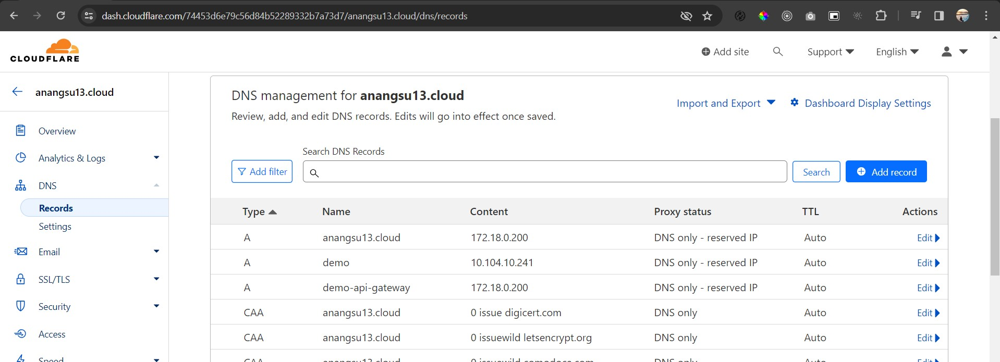
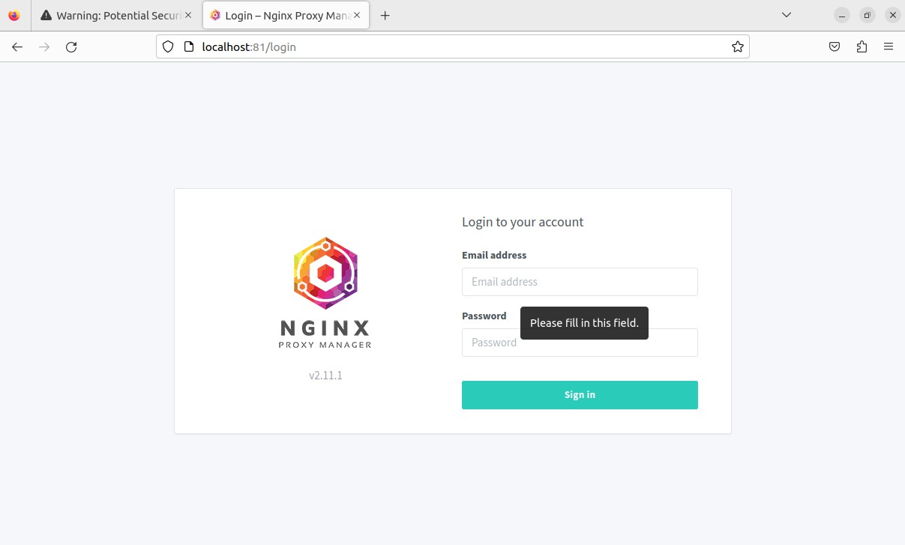
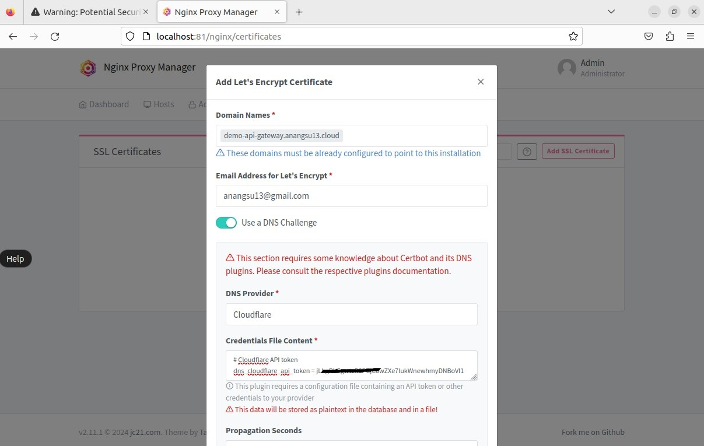
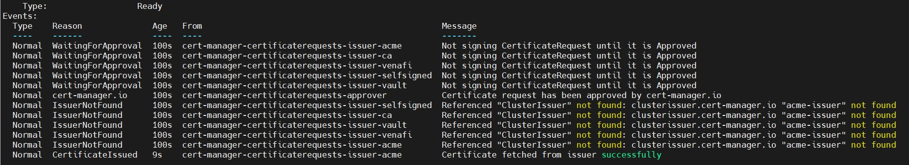
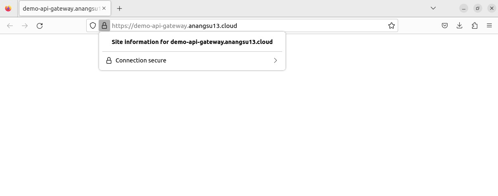
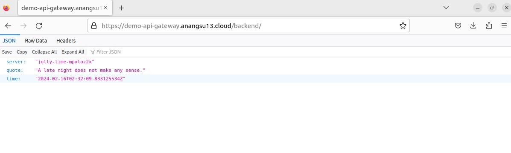

# Kubernetes API Gateway - Konfigurasi TLS (HTTPS) Ambassador Edge Stack dengan Cert-Manager

## 1. Install Kubernetes - *Kubernetes In Docker* Kind
- Ikuti petunjuk instalasi *kubernetes in docker Kind* yang tedapat pada dokumentasi resmi [Quick Start](https://kind.sigs.k8s.io/docs/user/quick-start/)
- Create Cluster *demo-cluster*
  ```
  kind create cluster --name demo-cluster --config yaml/kind-cluster.yaml
  ```
- Tunggu proses installasi beberapa saat. Untuk memastikan bahwa cluster telah berhasil dibuat gunakan perintah dibawah ini (pastikan kubectl telah di install - https://kubernetes.io/docs/tasks/tools/)
   ```
  kubectl cluster-info

  output:
  Kubernetes control plane is running at https://127.0.0.1:38785
  CoreDNS is running at https://127.0.0.1:38785/api/v1/namespaces/kube-system/services/kube-dns:dns/proxy
  ```
  ```
  kubectl get node
  ```

  |NAME |        STATUS |  ROLES   |        AGE  | VERSION |
  |------- |  :------  |  :------ |  :------ |  :------ |
  |demo-cluster-control-plane |  Ready  |  control-plane |  1m56s |  v1.29.1 |
  |demo-cluster-worker        |  Ready  |  <none>        |  1m56s |  v1.29.1 |
  
## 2. Install External Load Balancer - MetalLB v0.14.3
- Install MetalLb *Installation By Manifest*
  ```
  $ kubectl apply -f https://raw.githubusercontent.com/metallb/metallb/v0.14.3/config/manifests/metallb-native.yaml
  ```
  Dokumentasi lebih lengkap mengenai installasi MetalLb dapat mengacu pada dokumentasi resmi https://metallb.universe.tf/installation/

  ```
  kubectl -n metallb-system get pod
  ```
  |NAME                  |READY |  STATUS|    RESTARTS|   AGE|
  |------- |  :------  |  :------ |  :------ |  :------ |
  |controller-5f56cd6f78-bh6vl  | 1/1  |   Running  | 0  |     4m15s|
  |speaker-fvckx                | 1/1  |   Running  | 0  |     4m15s|
  |speaker-w4m9v                | 1/1  |   Running  | 0  |     4m15s|

- Konfigurasi MetalLB *Layer 2 Configuration*
  ```
  kubectl apply -f yaml/metallb-ipaddresspool.yaml
  kubectl apply -f yaml/metallb-l2advertisement.yaml
  ```
  Cek IPAddresspool untuk memastikan bahwa IP address Load Balancer telah dialokasikan pada rentang IP 172.18.0.200 - 172.18.0.210
    ```
  kubectl get ipaddresspool.metallb.io/first-pool -n metallb-system
  ```    
  | NAME |       AUTO ASSIGN |  AVOID BUGGY IPS |  ADDRESSES |
  |------- |  :------  |  :------ |  :------ |
  | first-pool  | true  |   false | ["172.18.0.200-172.18.0.210"]|

  Selanjutnya dokumentasi lebih lengkap untuk konfigurasi metalLB dapat mengacu pada https://metallb.universe.tf/configuration/

- Untuk memastikan Load Balancer MetalLB telah berfungsi, kita akan mencoba membuat sebuah *deployment nginx* yang akan di *expose* ke LoadBalancer
  ```
  kubectl create deploy nginx --image nginx
  kubectl expose deploy nginx --port 80 --type LoadBalancer
  ```
  Periksa bahwa pod nginx telah berjalan *Running*, dan telah di expose ke LoadBalancer
  ```
  kubectl get pod
  ```
  | NAME | READY |  STATUS  |  RESTARTS  | AGE |
  |------- |  :------  |  :------ |  :------ | ------: |
  | nginx-7854ff8877-q946f |  1/1 |  Running  | 0 | 18m |

  ```
  kubectl get svc
  ```
  |NAME   |  TYPE  |   CLUSTER-IP  |  EXTERNAL-IP | PORT(S)   |   AGE |
  |------- |  :------  |  :------ |  :------ |:------ | :------ |
  |kubernetes  | ClusterIP |  10.96.0.1  |   <none>    |     443/TCP    |    36m|
  |nginx   | LoadBalancer |  10.96.12.83  | 172.18.0.200 |  80:31133/TCP |  17m|

  EXTERNAL-IP pada *service nginx* adalah 172.18.0.210

  ```
  curl 172.18.0.200

  output:
  ...
  <h1>Welcome to nginx!</h1>
  <p>If you see this page, the nginx web server is successfully installed and
  working. Further configuration is required.</p>
  ...
  ```
  Selamat, proses instalasi *Load Balancer MetalLB* telah berhasil dan berjalan sebagai mana yang diharapkan.

  Untuk selanjutnya hapus saja *deployment* dan *service* nginx ini karena tidak akan digunakan lagi

  ```
  $ kubectl delete deploy nginx
  $ kubectl delete svc nginx
  ````

## 3. Install API Gateway - Ambassador Edge Stack
Proses installasi memerlukan token CLOUD_CONNECT_TOKEN dan untuk mendapatkan token tersebut silahkan registrasi atau login di  [Ambassador Cloud](https://app.getambassador.io/cloud/edge-stack/license/new) serta menggunakan *helm charts*. Jika helm charts belum ter-install, silahkan ikuti petunjuk installasi di https://helm.sh/docs/intro/install/

```
$ export CLOUD_CONNECT_TOKEN=token-dari-ambassador-cloud
```
- Install Ambassador Edge Stack
  ```
  # Add the Repo:
  helm repo add datawire https://app.getambassador.io
  helm repo update datawire
  
  # Create Namespace and Install:
  kubectl create namespace ambassador && \
  kubectl apply -f https://app.getambassador.io/yaml/edge-stack/3.10.1/aes-crds.yaml
  
  kubectl wait --timeout=90s --for=condition=available deployment emissary-apiext -n emissary-system
  
  helm install edge-stack --namespace ambassador datawire/edge-stack \
    --set emissary-ingress.agent.cloudConnectToken=$CLOUD_CONNECT_TOKEN && \
  kubectl -n ambassador wait --for condition=available --timeout=90s deploy -l product=aes
  ```
  Tunggu beberapa saat, pastikan POD pada namespace *emissary-system* dan *ambassador* telah berjalan

  ```
  $ kubectl get pod -A
  ```  
  |NAMESPACE    | NAME |  READY |  STATUS  |  RESTARTS    |  AGE|
  |------- |  :------  |  :------ |  :------ |:------ | :------ |
  |ambassador | edge-stack-5fb7477ddc-5psn2  | 1/1 |    Running  | 0 | 11m |
  |ambassador | edge-stack-5fb7477ddc-94cll |   1/1   |  Running | 0 | 11m |
  |ambassador | edge-stack-5fb7477ddc-wg765 |  1/1   |  Running  | 0 | 11m |
  |ambassador | edge-stack-agent-56d58979cc-jc6wt | 1/1 | Running | 0 |11m|
  |ambassador | edge-stack-redis-7456cfb6f6-5t6r8 | 1/1 | Running | 0 |11m|
  |emissary-system |emissary-apiext-5f546d44db-mbd8v | 1/1 |Running| 0 |20m|
  |emissary-system |emissary-apiext-5f546d44db-mczn6 |1/1|Running|0|20m|
  |emissary-system |emissary-apiext-5f546d44db-tgwvx|1/1|Running|0|20m|

- Routing Traffic from the edge
  ```
  # creating listener
  kubectl apply -f yaml/ambassador-listener.yaml

  # Apply the YAML for the "Quote" service
  kubectl apply -f https://app.getambassador.io/yaml/v2-docs/3.9.1/quickstart/qotm.yaml

  # Mapping resource
  kubectl apply -f yaml/ambassador-mapping.yaml
  ```
- Store the Ambassador Edge Stack load balancer IP address to a local environment variable
  ```
  export LB_ENDPOINT=$(kubectl -n ambassador get svc  edge-stack \
    -o "go-template={{range .status.loadBalancer.ingress}}{{or .ip .hostname}}{{end}}")
  ```
- Test konfigurasi dengan melakukan akses terhadap service Load Balancer Ambassador Edge Stack
  ```
  $ curl -Lki https://$LB_ENDPOINT/backend/

  output:
  HTTP/1.1 200 OK
  content-type: application/json
  date: Tue, 16 Feb 2024 18:45:48 GMT
  content-length: 153
  x-envoy-upstream-service-time: 0
  server: envoy

  {
      "server": "meaty-raspberry-ar2xud9e",
      "quote": "Utter nonsense is a storyteller without equal.",
      "time": "2024-02-16T18:45:48.051767814Z"
  }
  ```

  Selamat. Sampai pada tahap ini konfigurasi ambassador edge stack, mapping dan routing telah berhasil. Selanjutnya adalah konfigurasi TLS dengan cert-manager agar service bisa diakses dari luar cluster *public* melalui sebuah domain tanpa ada error invalid certificate pada browser.

  Lebih detail terkait instalasi dan konfigurasi Ambassador Edge Stack, dapat mengacu pada dokumentasi resmi https://www.getambassador.io/docs/edge-stack/latest/tutorials/getting-started
 
## 4. Konfigurasi DNS Domain pada Cloudflare
  Masuk ke halaman dasboard cloudflare https://dash.cloudflare.com/login dan tambahkan *record* DNS pada domain

  

## 5. Install Nginx Proxy Manager
  ```
  $ cd nginx-proxy-manager
  $ docker compose up -d
  ```

  Tunggu beberapa saat hingga proses pull image selesai dan container *nginx-proxy-manager-app-1* telah berjalan *Started*, untuk selanjutnya bisa diakses browser http://localhost:81/login

  ```
  Email:    admin@example.com
  Password: changeme
  ```
  

  Tambahkan SSL Sertificate dengan memilih DNS Provider Cloudflare dan sesuaikan *dns_cloudflare_api_token*. 
  
  Untuk mendapatkan *dns_cloudflare_api_token*, silahkan ikuti petunjuk dari https://cert-manager.io/docs/configuration/acme/dns01/cloudflare/

  
  
  Kemudian *Save* dan tunggu beberapa saat hingga proses selesai

## 6. Konfigurasi TLS dengan Cert-Manager
- Install Cert-Manager
  ```
  # Create the cert-manager CRD
  kubectl apply -f https://github.com/jetstack/cert-manager/releases/latest/download/cert-manager.crds.yaml

  # Add the jetstack Helm repository
  helm repo add jetstack https://charts.jetstack.io && helm repo update

  # Install cert-manager
  kubectl create ns cert-manager
  helm install cert-manager --namespace cert-manager jetstack/cert-manager
  ```
  
  ```
  $ kubectl -n cert-manager get pod
  ```
  |NAME | READY | STATUS  |  RESTARTS |  AGE |
  |------- |  :------  |  :------ |  :------ |:------ |
  |cert-manager-6c69f9f796-fbnt2 |  1/1 | Running | 0  | 4m42s |
  |cert-manager-cainjector-584f44558c-wdqr9 | 1/1  |  Running | 0 | 4m42s |
  |cert-manager-webhook-76f9945d6f-h84t9 | 1/1 | Running | 0 | 4m42s |
  
  ```
  $ kubectl apply -f yaml/cert-manager/Secret.yaml
  $ kubectl apply -f yaml/cert-manager/Certificate.yaml
  $ kubectl apply -f yaml/cert-manager/ClusterIssuer.yaml
  ```

  Lakukan pengecekan certificate:
   ```
  $ kubectl get certificate -n ambassador
  $ kubectl describe certificate <certificate-name> -n ambassador
  $ kubectl describe certificaterequest <certificate-name> -n ambassador
  ```
  

  Jika mengalami kendala terkait cert-manager, dapat mengacu pada dokumen *Troubleshooting* https://cert-manager.io/docs/troubleshooting/

  Selenjutnya terapkan certificate *ambassador-certs* pada *Host resources* ambassador
  
   ```
  $ kubectl apply -f yaml/ambassador-host.yaml

  # Periksa host resource ambassador
  $ kubectl get host -n ambassador
  ```

  |NAME  | HOSTNAME | STATE | PHASE COMPLETED | PHASE PENDING  | AGE |
  |------- | :------ | :------ |:------ |:------ |:------ |
  |example-host | demo-api-gateway.example.com | Ready | 20m |

  ```
  $ kubectl describe host example-host -n ambassador

  output:
  
  ...
  Spec:
    Acme Provider:
      Authority:  none
    ambassador_id:
      --apiVersion-v3alpha1-only--default
    Hostname:  demo-api-gateway.example.com
    Tls Secret:
      Name:  ambassador-certs
  Status:
    State:                   Ready
    Tls Certificate Source:  Other
  Events:
    Type    Reason  Age                  From                   Message
    ----    ------  ----                 ----                   -------
    Normal  Ready   63s (x373 over 13h)  Ambassador Edge Stack  Host with externally-provisioned TLS certificate marked Ready
  ```
  Jika domain di akses via browser, akan muncul tampilan seperti di bawah ini. Terlihat certificate valid tanpa ada *warning* invalid certificate pada browser

  

  