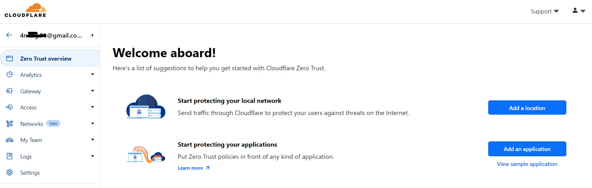
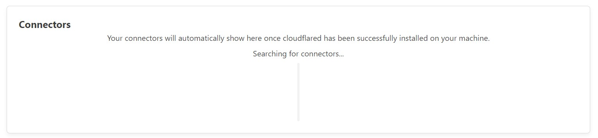
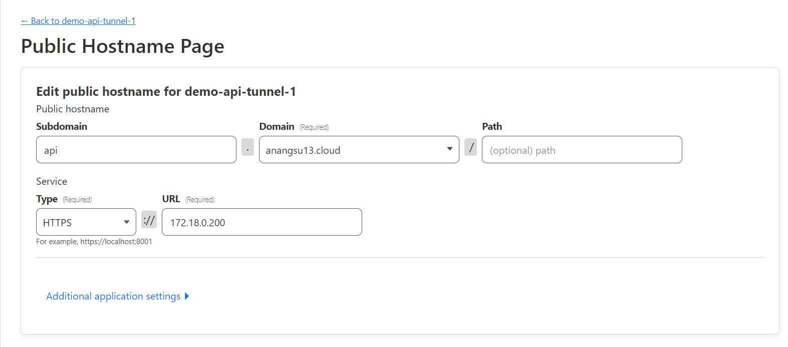
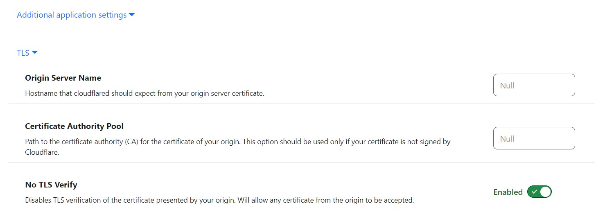
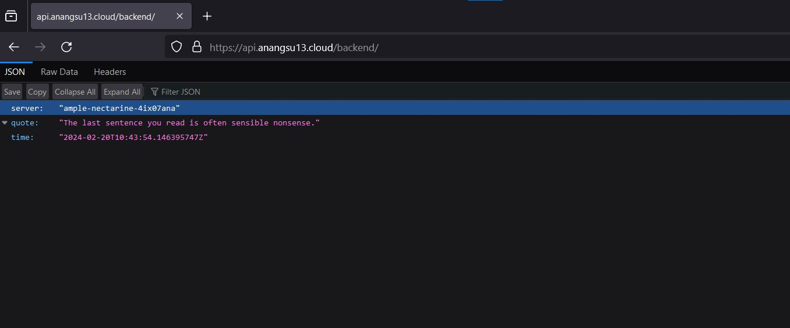
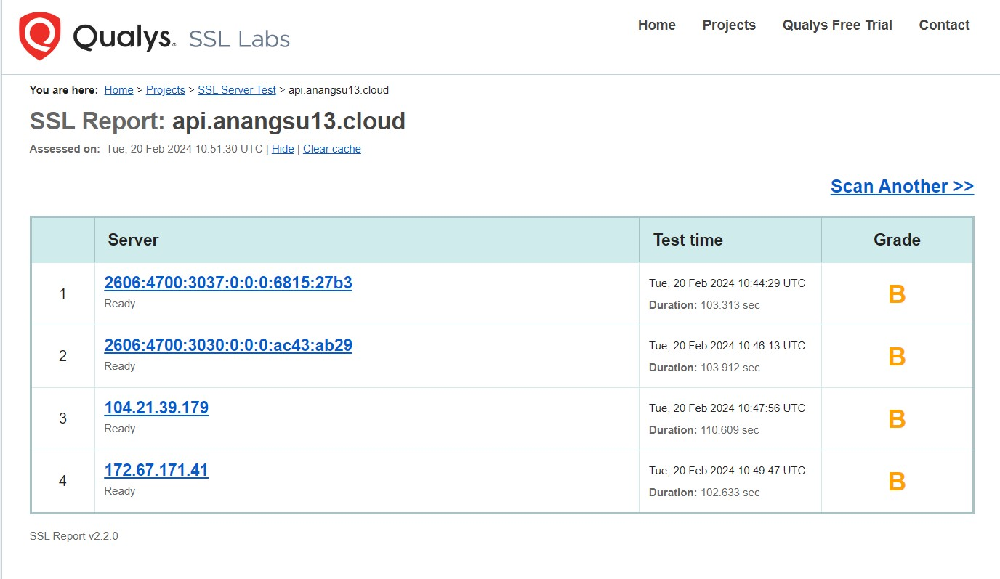

# API Gateway - Konfigurasi Domain HTTPS dengan Cloudflare tanpa IP Publik
Berikut adalah salah satu cara termudah meng-*online*-kan api gateway tanpa memiliki IP publik, api gateway yang digunakan disini adalah *ambassador edge stack*.

Mengenai bagaimana cara installasi *kubentetes in docker (kind)*, MetalLB *bare metal load-balancer for Kubernetes* dan installasi api gateway nya itu sendiri dapat dilihat pada *posting*-an sebelumnya mengenai [API Gateway - Konfigurasi TLS (HTTPS) Ambassador Edge Stack dengan Cert-Manager](https://github.com/anang5u/Kubernetes/tree/master/api-gateway/ambassador-edge-stack-tls-configuration) 

Disini akan dijelaskan *step-by-step* konfigurasi ***Zero Trust*** dari [Cloudflare](https://www.cloudflare.com/) tentang bagaimana melakukan akses TLS (https) secara publik terhadap api gateway tersebut tanpa IP Publik

Cek service *ambassador* yang telah di-*expose* melalui EXTERNAL-IP melalui load balancer metalLB:

```
$ kubectl get svc -n ambassador
```

| NAME | TYPE | CLUSTER-IP | EXTERNAL-IP | PORT(S) | AGE |
|----- | :---- | :---- | :---- | :---- | :---- |
| edge-stack | LoadBalancer | 10.96.156.210 | 172.18.0.200 | 80:31413/TCP,443:31215/TCP | 5d  |
| edge-stack-admin | ClusterIP | 10.96.100.174 |   <none> |   8877/TCP,8005/TCP      |        5d |
| edge-stack-agent  | ClusterIP    |  10.96.219.81  |  <none>    |     80/TCP       |                5d|
|dge-stack-redis |  ClusterIP   |   10.96.76.212  |  <none>    |     6379/TCP        |             5d|

terlihat EXTERNAL-IP nya adalah 172.18.0.200

```
curl -Lki https://172.18.0.200/backend/

output:
    HTTP/1.1 200 OK
    content-type: application/json
    date: Tue, 20 Feb 2024 12:51:36 GMT
    content-length: 156
    x-envoy-upstream-service-time: 0
    server: envoy

    {
        "server": "ample-nectarine-4ix07ana",
        "quote": "A principal idea is omnipresent, much like candy.",
        "time": "2024-02-20T12:51:36.241323186Z"
    }
```

## 1. Cloudflare - Zero Trust
- Login ke https://www.cloudflare.com/
- Pada menu *Website* silahkan tambahkan *Add a site* domain anda, disini domain yang digunakan adalah *anangsu13.cloud*
- Pilih menu *Zero Trust*
  


## 2. Cloudflare - Tunnels
- Pilih *Tunnel* pada menu *Networks*
- Create a tunnel
- Pilih *Cloudflared* sebagai connector, klik Next
- Pada bagian *Name your tunnel* isi dengan nama tunnel, kemudian klik Next
- *Install and run a connector* sesuai sistem operasi OS yang digunakan
- Pastikan connector telah berjalan
  


## 3. Cloudflare - Public Hostname
- Klik Add a public hostnames
- Lakukan pengisian input pada halaman *Public Hostname Page*, dimana URL diarahkan ke IP https://172.18.0.200
  


- Pada bagian *Additional application settings*, aktifkan *No TLS Verify*



## 4. Test Akses Domain secara Publik
Setelah melalui tahap-tahap konfigurasi tersebut diatas, saatnya melalukan akses domain https://api.anangsu13.cloud



SELAMAT, sekarang api gateway *ambassador edge stack* yang menjadi penghubung antara dunia luar *downstream* dengan cluster kubernetes *upstream* sudah bisa diakses melalui  internet secara publik

