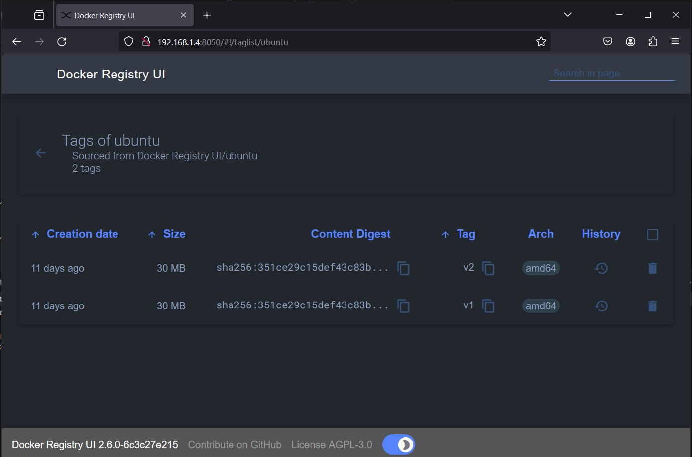

# Docker Registry - Authenticate Proxy with Nginx, Letsencrypt Certificates and Registry UI

## Create the required directories
```
$ mkdir -p auth data certbot
```

## Create user password
```
$ docker run --rm --entrypoint htpasswd httpd -Bbn testuser testpassword > auth/nginx.htpasswd
```

## Docker compose
`docker-compose.yaml`
```
---
version: '3'

services:
  nginx:
    image: nginx:alpine
    ports:
      - 5043:443
    restart: always
    depends_on:
      - registry
    volumes:
      - ./auth:/etc/nginx/conf.d
      - ./auth/nginx.conf:/etc/nginx/nginx.conf:ro
      - ./certbot/www:/var/www/certbot/:ro
      - ./certbot/conf/:/etc/nginx/ssl/:ro
  certbot:
    image: certbot/certbot:latest
    restart: always
    volumes:
      - ./certbot/www/:/var/www/certbot/:rw
      - ./certbot/conf/:/etc/letsencrypt/:rw
  registry:
    image: registry:2
    restart: always
    volumes:
      - ./data:/var/lib/registry
  # -----------
  # Registry UI
  # Thanks for Joxit https://github.com/Joxit/docker-registry-ui
  registry-ui:
    image: joxit/docker-registry-ui:main
    restart: always
    ports:
      - 8050:80
    environment:
      - SINGLE_REGISTRY=true
      - REGISTRY_TITLE=Docker Registry UI
      - DELETE_IMAGES=true
      - SHOW_CONTENT_DIGEST=true
      - NGINX_PROXY_PASS_URL=http://registry:5000
      - SHOW_CATALOG_NB_TAGS=true
      - CATALOG_MIN_BRANCHES=1
      - CATALOG_MAX_BRANCHES=1
      - TAGLIST_PAGE_SIZE=100
      - REGISTRY_SECURED=false
      - CATALOG_ELEMENTS_LIMIT=1000
    container_name: registry-ui
```

## Nginx configuration 
Konfigurasi nginx `auth/nginx.conf`
```
events {
    worker_connections  1024;
}

http {

  upstream docker-registry {
    server registry:5000;
  }

  ## Set a variable to help us decide if we need to add the
  ## 'Docker-Distribution-Api-Version' header.
  ## The registry always sets this header.
  ## In the case of nginx performing auth, the header is unset
  ## since nginx is auth-ing before proxying.
  map $upstream_http_docker_distribution_api_version $docker_distribution_api_version {
    '' 'registry/2.0';
  }

  server {
    listen 443 ssl;
    server_name {domain};

    # SSL
    ssl_certificate /etc/nginx/ssl/live/{domain}/fullchain.pem;
    ssl_certificate_key /etc/nginx/ssl/live/{domain}/privkey.pem;

    # Recommendations from https://raymii.org/s/tutorials/Strong_SSL_Security_On_nginx.html
    ssl_protocols TLSv1.1 TLSv1.2;
    ssl_ciphers 'EECDH+AESGCM:EDH+AESGCM:AES256+EECDH:AES256+EDH';
    ssl_prefer_server_ciphers on;
    ssl_session_cache shared:SSL:10m;

    # disable any limits to avoid HTTP 413 for large image uploads
    client_max_body_size 0;

    # required to avoid HTTP 411: see Issue #1486 (https://github.com/moby/moby/issues/1486)
    chunked_transfer_encoding on;

    location /v2/ {
      # Do not allow connections from docker 1.5 and earlier
      # docker pre-1.6.0 did not properly set the user agent on ping, catch "Go *" user agents
      if ($http_user_agent ~ "^(docker\/1\.(3|4|5(?!\.[0-9]-dev))|Go ).*$" ) {
        return 404;
      }

      # To add basic authentication to v2 use auth_basic setting.
      auth_basic "Registry realm";
      auth_basic_user_file /etc/nginx/conf.d/nginx.htpasswd;

      ## If $docker_distribution_api_version is empty, the header is not added.
      ## See the map directive above where this variable is defined.
      add_header 'Docker-Distribution-Api-Version' $docker_distribution_api_version always;

      proxy_pass                          http://docker-registry;
      proxy_set_header  Host              $http_host;   # required for docker client's sake
      proxy_set_header  X-Real-IP         $remote_addr; # pass on real client's IP
      proxy_set_header  X-Forwarded-For   $proxy_add_x_forwarded_for;
      proxy_set_header  X-Forwarded-Proto $scheme;
      proxy_read_timeout                  900;
    }
  }
}
```

## Generate certificate
```
$ docker-compose run certbot certonly -d {domain} \
--manual --preferred-challenges dns --dry-run

...
- - - - - - - - - - - - - - - - - - - - - - - - - - - - - - - - - - - - - - - -
Press Enter to Continue
The dry run was successful.
```
Untuk generate certificate, ulangi perintah diatas tanpa *flag* `--dry-run` 
```
$ docker-compose run certbot certonly -d {domain} \
--manual --preferred-challenges dns

...
Successfully received certificate.
Certificate is saved at: /etc/letsencrypt/live/{domain}/fullchain.pem
Key is saved at:         /etc/letsencrypt/live/{domain}/privkey.pem
This certificate expires on 2024-06-06.
These files will be updated when the certificate renews.

NEXT STEPS:
- This certificate will not be renewed automatically. Autorenewal of --manual certificates requires the use of an authentication hook script (--manual-auth-hook) but one was not provided. To renew this certificate, repeat this same certbot command before the certificate's expiry date.

- - - - - - - - - - - - - - - - - - - - - - - - - - - - - - - - - - - - - - - -
If you like Certbot, please consider supporting our work by:
 * Donating to ISRG / Let's Encrypt:   https://letsencrypt.org/donate
 * Donating to EFF:                    https://eff.org/donate-le
- - - - - - - - - - - - - - - - - - - - - - - - - - - - - - - - - - - - - - - -
```
Renewing the certificates
```
$ docker compose run --rm certbot renew
```
## Deploy registry

```
$ docker compose up -d
```

### Akses registry tanpa user password
```
$ curl -Lki https://localhost:5043/v2/_catalog

HTTP/1.1 401 Unauthorized
Server: nginx/1.25.4
...

$ curl -Lki https://localhost:5043/v2/_catalog -sS -o /dev/null -w "%{http_code}\n"
401
```

### Akses registry dengan user password
```
$ curl -Lki -u testuser:testpassword https://localhost:5043/v2/_catalog
HTTP/1.1 200 OK
Server: nginx/1.25.4
...

{"repositories":[]}

$ curl -Lki -u testuser:testpassword  https://localhost:5043/v2/_catalog -sS -o /dev/null -w "%{http_code}\n"
200
```

## Push dan Pull image
```
$ docker login https://localhost:5043
Username: testuser
Password:
WARNING! Your password will be stored unencrypted in /root/.docker/config.json.
Configure a credential helper to remove this warning. See
https://docs.docker.com/engine/reference/commandline/login/#credentials-store

Login Succeeded

# Pull image dari docker hub
$ docker pull ubuntu

# Tag the image so that it points to your registry
$ docker image tag ubuntu localhost:5043/ubuntu:v1

# Push it
$ docker push localhost:5043/ubuntu:v1

# Pull it back
$ docker pull localhost:5043/ubuntu:v1

# Logout
$ docker logout localhost:5043
Removing login credentials for localhost:5043
```

## Push dan Pull image dari external
Docker regstry di arahkan melalui sebuah domain `registry.anangsu13.cloud`

```
$ docker login registry.anangsu13.cloud
Username: testuser
Password:
Login Succeeded

# Pull image dari docker hub
$ docker pull ubuntu

# Tag the image so that it points to your registry
$ docker image tag ubuntu registry.anangsu13.cloud/ubuntu:v2

# Push it
$ docker push registry.anangsu13.cloud/ubuntu:v2

# Pull it back
$ docker pull registry.anangsu13.cloud/ubuntu:v2

# Logout
$ docker logout registry.anangsu13.cloud
Removing login credentials for registry.anangsu13.cloud
```

## Docker Registry UI


### References
- https://distribution.github.io/distribution/recipes/nginx/
- https://pentacent.medium.com/nginx-and-lets-encrypt-with-docker-in-less-than-5-minutes-b4b8a60d3a71
- https://mindsers.blog/en/post/https-using-nginx-certbot-docker/
- https://github.com/Joxit/docker-registry-ui

