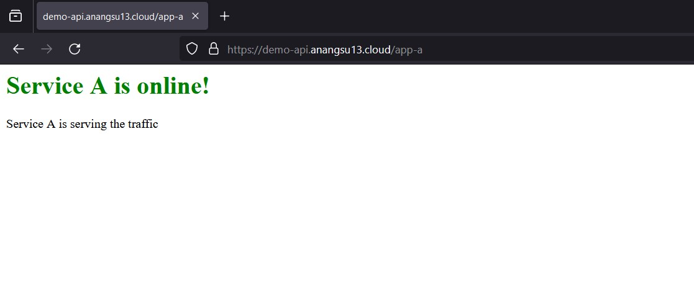
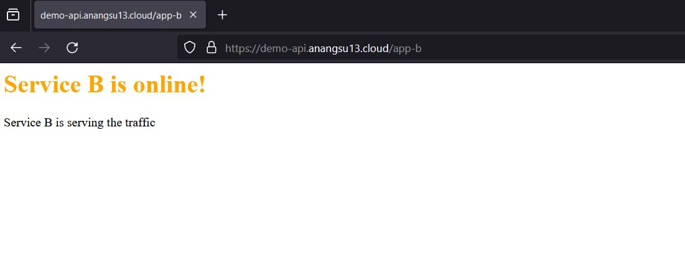

# Install Istio Gateway  in Kubernetes Cluster

Berikut cara termudah untuk melakukan installasi [istio](https://istio.io/) pada *kubernetes cluster* [kind](https://kind.sigs.k8s.io/)

```
$ kind create cluster --name demo-cluster --config yaml/kind-cluster.yaml
```

Tahap-tahap installasi *kubernetes kind* dan *bare metal* Load Balancer *MetalLB* bisa dilihat [disini](https://github.com/anang5u/Kubernetes/tree/master/api-gateway/ambassador-edge-stack-tls-configuration)


```
$ kubectl version

output:
Client Version: v1.29.2
Kustomize Version: v5.0.4-0.20230601165947-6ce0bf390ce3
Server Version: v1.29.2
```

```
$ kubectl cluster-info

output:
Kubernetes control plane is running at https://127.0.0.1:34561
CoreDNS is running at https://127.0.0.1:34561/api/v1/namespaces/kube-system/services/kube-dns:dns/proxy

To further debug and diagnose cluster problems, use 'kubectl cluster-info dump'.
```
```
$ kubectl get namespace
NAME                 STATUS   AGE
default              Active   60m
istio-system         Active   51m
kube-node-lease      Active   60m
kube-public          Active   60m
kube-system          Active   60m
local-path-storage   Active   60m

```

## Install Istio with Helm

```
# Configure the Helm repository
$ helm repo add istio https://istio-release.storage.googleapis.com/charts
$ helm repo update

# Installing istio base CRDs
$ helm install istio-base istio/base -n istio-system --set defaultRevision=default --create-namespace

# Validate the CRD installation with the helm ls command:
$ helm ls -n istio-system
NAME       NAMESPACE    REVISION UPDATED         STATUS   CHART        APP VERSION
istio-base istio-system 1        ... ... ... ... deployed base-1.20.3  1.20.3
```
pastikan STATUS *istio-base* adalah *deployed*

```
# Install the Istio discovery chart which deploys the istiod service
# Installing istiod (control plane)
$ helm install istiod istio/istiod -n istio-system --wait

# Verify the Istio discovery chart installation
$ helm ls -n istio-system
NAME            NAMESPACE       REVISION        UPDATED         STATUS          CHART           APP VERSION
istio-base      istio-system    1               ... ... ... ... deployed        base-1.20.3     1.20.3
istiod          istio-system    1               ... ... ... ... deployed        istiod-1.20.3   1.20.3

# Get the status of the installed helm chart to ensure it is deployed
$ helm status istiod -n istio-system
NAME: istiod
LAST DEPLOYED: Wed Feb 21 11:42:39 2024
NAMESPACE: istio-system
STATUS: deployed
REVISION: 1
TEST SUITE: None
NOTES:
"istiod" successfully installed!

To learn more about the release, try:
  $ helm status istiod
  $ helm get all istiod

Next steps:
  * Deploy a Gateway: https://istio.io/latest/docs/setup/additional-setup/gateway/
  * Try out our tasks to get started on common configurations:
    * https://istio.io/latest/docs/tasks/traffic-management
    * https://istio.io/latest/docs/tasks/security/
    * https://istio.io/latest/docs/tasks/policy-enforcement/
  * Review the list of actively supported releases, CVE publications and our hardening guide:
    * https://istio.io/latest/docs/releases/supported-releases/
    * https://istio.io/latest/news/security/
    * https://istio.io/latest/docs/ops/best-practices/security/

For further documentation see https://istio.io website

# Check istiod service is successfully installed and its pods are running
$ kubectl get deployments -n istio-system --output wide
NAME     READY   UP-TO-DATE   AVAILABLE   AGE   CONTAINERS   IMAGES                         SELECTOR
istiod   1/1     1            1           48m   discovery    docker.io/istio/pilot:1.20.3   istio=pilot

```
dokumentasi lebih lengkap mengenai install istio dengan helm bisa dilihat di https://istio.io/latest/docs/setup/install/helm/

## Installing Gateways
```
$ helm install istio-gateway istio/gateway -n istio-system

# Cek SVC, POD
$ kubectl get svc,pod -n istio-system
NAME                    TYPE           CLUSTER-IP     EXTERNAL-IP    PORT(S)                                      AGE
service/istio-gateway   LoadBalancer   10.96.44.204   172.18.0.210   15021:30906/TCP,80:30095/TCP,443:30580/TCP   71s
service/istiod          ClusterIP      10.96.86.182   <none>         15010/TCP,15012/TCP,443/TCP,15014/TCP        75m

NAME                                 READY   STATUS    RESTARTS   AGE
pod/istio-gateway-5f7f7c65d8-8vqmw   1/1     Running   0          71s
pod/istiod-77fc789879-wx8d5          1/1     Running   0          75m
```
EXTERNAL-IP sevice/istio-gateway adalah 172.18.0.210

```
# Deploy service A dan service B
$ kubectl apply -f yaml/services.yaml

# Cek SVC, POD
$ kubectl get svc,pod
NAME                 TYPE        CLUSTER-IP     EXTERNAL-IP   PORT(S)   AGE
service/kubernetes   ClusterIP   10.96.0.1      <none>        443/TCP   100m
service/service-a    ClusterIP   10.96.61.14    <none>        80/TCP    103s
service/service-b    ClusterIP   10.96.53.123   <none>        80/TCP    102s

NAME            READY   STATUS    RESTARTS   AGE
pod/service-a   2/2     Running   0          102s
pod/service-b   2/2     Running   0          102s

# Deploy gateway
$ kubectl apply -f yaml/gateway.yaml
$ kubctl get gw,vs
NAME                                        AGE
gateway.networking.istio.io/istio-gateway   3m56s

NAME                                          GATEWAYS            HOSTS   AGE
virtualservice.networking.istio.io/istio-vs   ["istio-gateway"]   ["*"]   3m56s
```

Test akses service dengan curl dan domain publik
```
# Service A
$ curl -Lki http://172.18.0.210/app-a
HTTP/1.1 200 OK
server: istio-envoy
date: Wed, 21 Feb 2024 13:25:52 GMT
content-type: text/html
content-length: 133
last-modified: Wed, 21 Feb 2024 13:09:34 GMT
etag: "65d5f60e-85"
accept-ranges: bytes
x-envoy-upstream-service-time: 4

<html>
  <body>
    <h1 style="color:green">Service A is online!</h1>
    <p>Service A is serving the traffic </p>
  </body>
</html>
```

```
# Service B
$ curl -Lki http://172.18.0.210/app-b
HTTP/1.1 200 OK
server: istio-envoy
date: Wed, 21 Feb 2024 13:26:37 GMT
content-type: text/html
content-length: 134
last-modified: Wed, 21 Feb 2024 13:09:34 GMT
etag: "65d5f60e-86"
accept-ranges: bytes
x-envoy-upstream-service-time: 1

<html>
  <body>
    <h1 style="color:orange">Service B is online!</h1>
    <p>Service B is serving the traffic </p>
  </body>
</html>

```





References:
- https://github.com/shabbirsaifee92/multi-node-kind-cluster/tree/main