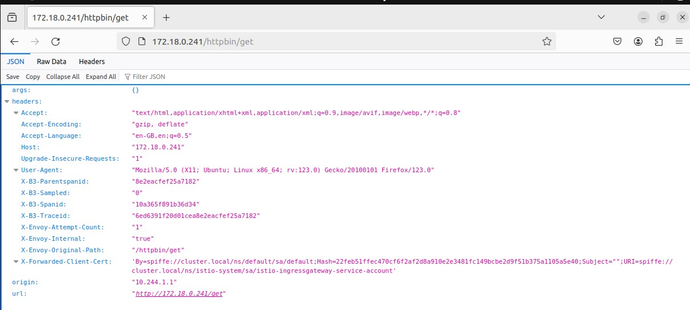

# Istio-Service Mesh with Kubernetes in Docker Kind

## Install Docker Engine
Sebelum memulai, pastikan *docker engine* telah di-*install*, atau silahkan mengikuti paduan untuk melakukan installasi https://docs.docker.com/engine/install/

```
$ docker --version
Docker version 25.0.3, build 4debf41
```

## Install Kubernetes in Docker Kind
Ikuti paduan installasi kind https://kind.sigs.k8s.io/docs/user/quick-start/

```
$ kind --version
kind version 0.22.0
```

## Create Kubernetes Cluster
Disini akan mencoba membuat cluster kubernetes menggunakan  *kind-config.yaml* yang terdiri dari 2 node masing-masing untuk *node master (controll-plane)* dan *node worker*

```
$ kind create cluster --name demo-cluster --config yaml/kind-config.yaml
Creating cluster "demo-cluster" ...
 ✓ Ensuring node image (kindest/node:v1.29.2) 🖼
 ✓ Preparing nodes 📦 📦
 ✓ Writing configuration 📜
 ✓ Starting control-plane 🕹️
 ✓ Installing CNI 🔌
 ✓ Installing StorageClass 💾
 ✓ Joining worker nodes 🚜
Set kubectl context to "kind-demo-cluster"
You can now use your cluster with:

kubectl cluster-info --context kind-demo-cluster
```

Periksa kubernetes cluster *domo-cluster* telah sukses terinstall. Sebelumnya, pastikan bahwa *kubectl* telah ter-install pada sistem operasi anda https://kubernetes.io/docs/tasks/tools/
```
$ kubectl cluster-info
Kubernetes control plane is running at https://127.0.0.1:37425
CoreDNS is running at https://127.0.0.1:37425/api/v1/namespaces/kube-system/services/kube-dns:dns/proxy

$ kubectl get nodes
NAME                         STATUS   ROLES           AGE     VERSION
demo-cluster-control-plane   Ready    control-plane   2m29s   v1.29.2
demo-cluster-worker          Ready    <none>          2m5s    v1.29.2
```
Selengkapnya tentang *kind* bisa mengacu pada dokumentasi resmi https://kind.sigs.k8s.io/

## Install External Load Balancer - MetalLB v0.14.3 
```
$ kubectl apply -f https://raw.githubusercontent.com/metallb/metallb/v0.14.3/config/manifests/metallb-native.yaml
$ kubectl apply -f yaml/metallb-config.yaml

$ kubectl get pod -n metallb-system
NAME                          READY   STATUS    RESTARTS   AGE
controller-5f56cd6f78-87jhd   1/1     Running   0          1m29s
speaker-2c8rs                 1/1     Running   0          1m29s
speaker-gjzf5                 1/1     Running   0          1m29s
```
https://metallb.universe.tf/installation/

## Install Istio dengan Istioctl
Sebelum memulai, disini installasi *istio* dilakukan di dalam sebuah container `alpine linux` untuk menjaga agar *mesin* tetap bersih tidak bercampur dengan aplikasi lain

### Get a container to work in

```
$ docker run -it --rm -v ${HOME}:/root/ -v ${PWD}:/work -w /work --net host alpine sh

# install curl & kubectl
$ apk add --no-cache curl nano
$ curl -LO https://storage.googleapis.com/kubernetes-release/release/`curl -s https://storage.googleapis.com/kubernetes-release/release/stable.txt`/bin/linux/amd64/kubectl
$ chmod +x ./kubectl
$ mv ./kubectl /usr/local/bin/kubectl
$ export KUBE_EDITOR="nano"

# test akses cluster
$ kubectl get nodes
NAME                         STATUS   ROLES           AGE   VERSION
demo-cluster-control-plane   Ready    control-plane   60m   v1.29.2
demo-cluster-worker          Ready    <none>          59m   v1.29.2
```
### Download dan Install Istio
```
$ curl -L https://istio.io/downloadIstio | sh -

$ mv istio-1.20.3/bin/istioctl /usr/local/bin/
$ chmod +x /usr/local/bin/istioctl
$ mv istio-1.20.3 /tmp/
```
### Pre flight checks
```
$ istioctl x precheck
✔ No issues found when checking the cluster. Istio is safe to install or upgrade!
```

### Istio Profiles
https://istio.io/latest/docs/setup/additional-setup/config-profiles/
```
$ istioctl profile list
```

### Install dengan Default Profiles
```
$ istioctl install --set profile=default
This will install the Istio 1.20.3 "default"... Proceed? (y/N) y
✔ Istio core installed
✔ Istiod installed
✔ Ingress gateways installed
✔ Installation complete
Made this installation the default for injection and validation.

$ kubectl -n istio-system get pods
NAME                                    READY   STATUS    RESTARTS   AGE
istio-ingressgateway-7ddcd66b54-l6qcw   1/1     Running   0          99s
istiod-77fc789879-rrmx9                 1/1     Running   0          3m14s

$ istioctl proxy-status
NAME                                                   CLUSTER        CDS        LDS        EDS        RDS          ECDS         ISTIOD                      VERSION
istio-ingressgateway-7ddcd66b54-l6qcw.istio-system     Kubernetes     SYNCED     SYNCED     SYNCED     NOT SENT     NOT SENT     istiod-77fc789879-rrmx9     1.20.3

$ kubectl -n istio-system get deploy
NAME                   READY   UP-TO-DATE   AVAILABLE   AGE
istio-ingressgateway   1/1     1            1           4m40s
istiod                 1/1     1            1           6m15s

$ kubectl -n istio-system get svc
NAME                   TYPE           CLUSTER-IP      EXTERNAL-IP    PORT(S)                                      AGE
istio-ingressgateway   LoadBalancer   10.96.184.245   172.18.0.240   15021:30275/TCP,80:32388/TCP,443:30820/TCP   9m35s
istiod                 ClusterIP      10.96.68.58     <none>         15010/TCP,15012/TCP,443/TCP,15014/TCP        11m
```
Ingress Gateway `istio-ingressgateway` telah di *assign* load balancer MetalLB pada EXTERNAL-IP **172.18.0.241** dan port **15021**

```
$ curl -Lki 172.18.0.241:15021
HTTP/1.1 404 Not Found
date: Mon, 04 Mar 2024 04:16:50 GMT
server: envoy
content-length: 0
```

## Deploy Example Microservice
Sebagai contoh, disini mencoba melakukan *deployment* microservice [kennethreitz/httpbin](https://httpbin.org/) yang akan di *expose* pada port 80

```
$ kubectl create deploy httpbin --image kennethreitz/httpbin
$ kubectl expose deploy httpbin --port 80

$ kubectl get pod,svc
NAME                          READY   STATUS    RESTARTS   AGE
pod/httpbin-66c877d7d-2xsqc   1/1     Running   0          4m24s

NAME                 TYPE        CLUSTER-IP      EXTERNAL-IP   PORT(S)    AGE
service/httpbin      ClusterIP   10.96.218.148   <none>        8080/TCP   4m12s
service/kubernetes   ClusterIP   10.96.0.1       <none>        443/TCP    4h51m

```
Istio Automated Injection
```
$ kubectl label namespace/default istio-injection=enabled
namespace/default labeled

# restart all pods to get sidecar injected
$ kubectl delete pods --all
$ kubectl get pod
NAME                      READY   STATUS    RESTARTS   AGE
httpbin-66c877d7d-f4wv8   2/2     Running   0          35s

$ get svc
NAME         TYPE        CLUSTER-IP    EXTERNAL-IP   PORT(S)   AGE
httpbin      ClusterIP   10.96.5.192   <none>        80/TCP    8m53s
kubernetes   ClusterIP   10.96.0.1     <none>        443/TCP   97m
```

## Akses Microservice
Melakukan akses terhadap microservice *httpbin* yang berada di dalam cluster melalui istio gateway
- Gateway, https://istio.io/latest/docs/reference/config/networking/gateway/
- Virtual Service, https://istio.io/latest/docs/reference/config/networking/virtual-service/

Deploy Gateway, Virtual Service
```
$ kubectl apply -f yaml/istio-gateway.yaml
$ kubectl get gw,vs
NAME                                               AGE
gateway.networking.istio.io/istio-ingressgateway   5m20s

NAME                                             GATEWAYS                   HOSTS   AGE
virtualservice.networking.istio.io/demo-routes   ["istio-ingressgateway"]   ["*"]   5m20s
```
Akses microservice *httpbin* melalui *curl*
```
$ curl 172.18.0.241/httpbin/get
{
  "args": {},
  "headers": {
    "Accept": "*/*",
    "Host": "172.18.0.241",
    "User-Agent": "curl/7.81.0",
    "X-B3-Parentspanid": "a86f36de13cd212f",
    "X-B3-Sampled": "0",
    "X-B3-Spanid": "e8373e8ab7a1afa8",
    "X-B3-Traceid": "76c2a0126715fa4ea86f36de13cd212f",
    "X-Envoy-Attempt-Count": "1",
    "X-Envoy-Internal": "true",
    "X-Envoy-Original-Path": "/httpbin/get",
    "X-Forwarded-Client-Cert": "By=spiffe://cluster.local/ns/default/sa/default;Hash=22feb51ffec470cf6f2af2d8a910e2e3481fc149bcbe2d9f51b375a1105a5e40;Subject=\"\";URI=spiffe://cluster.local/ns/istio-system/sa/istio-ingressgateway-service-account"
  },
  "origin": "10.244.1.1",
  "url": "http://172.18.0.241/get"
}
```
Akses microservice *httpbin* dengan *browser*
```
172.18.0.241/httpbin/get
```



## Bersih-Bersih
```
$ kind delete cluster --name demo-cluster
```


